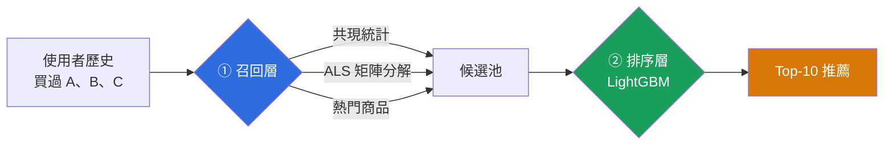

# 大規模推薦系統：5.71 億筆 Amazon 評論

在**一台桌機**上，對完整的 Amazon Reviews 2023 資料集端到端建立推薦系統。
無 GPU、無叢集、無雲端。


### 📊 [**互動式報告 →**](https://mina201199.github.io/amazon-recsys-571m/reports/web_report.html)

一頁讀完整個專案：資料規模、三個被量測推翻的假設、系統架構與結果。

---

## 1. 解決什麼問題

> **給定使用者過去買過什麼，預測他接下來會買什麼。**

輸出一份排序過的 Top-10 推薦清單——就是 Amazon 首頁「為你推薦」在做的事。

這個問題的難處不在演算法，而在**規模**：

| | |
|---|---|
| 要從幾個商品中挑 10 個？ | **4819 萬個** |
| 有多少使用者需要推薦？ | **5451 萬位** |
| 可用的歷史互動有多少筆？ | **5.71 億筆**（1996–2023） |

對 4819 萬個商品逐一打分是不可能的。本專案用業界實際採用的架構解決這件事。

---

## 2. 系統怎麼運作



**兩階段的意義**：召回層用便宜的統計方法把 4819 萬縮到約 500 個，
排序層再用昂貴的模型精排這 500 個。若省略召回層，每次推薦都要對
4819 萬個商品打分，線上服務不可能負擔。

```
資料流

  71.2 GB              6.0 GB               ~500 個              10 個
  原始 JSON   ──解析──▶  Parquet   ──召回──▶   候選    ──排序──▶  推薦
  5.71 億筆            5.64 億筆            /每位使用者
  (30.8 分鐘)          (12x 壓縮)
```

---

## 3. 用了哪些技術，為什麼

| 技術 | 用途 | **為什麼選它** |
|---|---|---|
| **DuckDB** | 資料處理與聚合 | 單機可超出記憶體處理、自動吃滿 20 執行緒。**不用 Spark**：資料壓縮後僅 6 GB 而機器有 64 GB 記憶體，分散式框架只會增加維運複雜度而沒有效益 |
| **Parquet + ZSTD** | 儲存格式 | 欄式儲存讓 `DISTINCT user_id` 這類查詢只掃單一欄位。實測壓縮比 **12 倍** |
| **implicit (ALS)** | 召回：矩陣分解 | 隱式回饋的標準解法，CPU 版本在本專案規模下夠用 |
| **LightGBM** | 排序層 | 表格資料上的首選，LambdaRank 直接優化排序而非逐點預測 |
| **Polars / NumPy** | 特徵運算 | 向量化，避免逐使用者的 Python 迴圈 |
| **uv** | 環境管理 | `uv.lock` 鎖死版本，實驗可重現——這在面試中比用什麼套件更重要 |
| **pytest** | 測試 | 75 個測試，驗證的是**不變量**而非「跑得完」 |

**刻意不用的**：Spark（見上）、深度學習推薦模型（無 GPU 且時間不足）、
評論文字的 NLP（先把行為訊號做好）。

---

## 4. 架構

```
src/amazon_recsys/
├── ingest/
│   ├── download.py           平行下載 + 續傳（經 sha256 驗證）
│   ├── build_interactions.py JSON → 整數編碼 → 年分區 Parquet
│   └── sample.py             按使用者抽樣（非按列）
├── recall/
│   ├── base.py               通道介面、多路合併
│   ├── popularity.py         熱門商品（必須被打敗的基線）
│   ├── covisitation.py       共現統計「買了 A 的人也買 B」
│   └── als.py                矩陣分解
├── ranking/                  LightGBM 精排（開發中）
└── evaluation/
    ├── metrics.py            Recall@K、NDCG@K、覆蓋率
    ├── splits.py             時間切分 + 洩漏守門員
    └── quality.py            資料品質報告

scripts/   01_download → 02_build_interactions → 04_data_quality
           05_make_sample → 06_recall_eval
docs/specs/  設計文件
```

**資料與程式碼分離**：資料在 `D:\amazon-reviews-2023\`，永不進版控。
`.gitignore` 寫得很嚴——71 GB 誤推上 GitHub 後要清 git 歷史會非常痛苦。

---

## 5. 工程亮點

### 5.1 一次被自己的基準測試推翻的假設

全量轉檔跑了 75 分鐘未完成、溢寫 73 GB。我判斷是去重用的視窗函數太慢，
準備改寫成 `GROUP BY`。**先做了基準測試，結果推翻了這個假設**：

| 去重做法（2950 萬列） | 耗時 |
|---|---|
| 視窗函數（原做法） | **3.6 s** |
| `GROUP BY` 雜湊聚合 | 9.3 s（慢 2.6 倍） |
| 先整數編碼再 `GROUP BY` | 22.2 s（慢 6 倍） |

三者結果列數完全一致，是公平比較。**我提議的「修正」反而更慢。**

真因要量測記憶體才浮現：

```
記憶體暫存表每列佔用  85.5 bytes   ← 實測
全量 5.71 億列      = 45.5 GB
記憶體上限           = 48 GB      ← 被吃掉 95%
```

問題不在演算法，在於**那張表根本不該進記憶體**。改成中間以 Parquet 落地
後，全量轉檔 **30.8 分鐘完成，溢寫從 73 GB 降到 37 GB**。

> 這件事的教訓不是「Parquet 比較好」，而是**先量測再修，不要照著直覺改**。

### 5.2 記憶體上界的取捨

階段 3 最終仍改用 `GROUP BY`，但理由與最初的猜測完全不同：

- 視窗函數需要對**輸入**做全域排序 → 記憶體上界 = 輸入大小（45 GB）
- `GROUP BY` 的雜湊表只跟**輸出**的列數成正比 → 上界 = 去重後大小（約 11 GB）

單看速度視窗函數較快，但輸入遠大於記憶體時，只有 `GROUP BY` 跑得完。

### 5.3 稀疏性讓「做全量」從偏好變成必要條件

先在單一類別（All_Beauty，70 萬筆）上試跑，結果令人卻步：

| | 單一類別 | **全量 33 類** |
|---|---|---|
| 只有 1 筆互動的使用者 | **92.3%** | **19.2%** |
| 平均每人互動數 | 1.15 | **10.36** |
| 可用於評估的使用者 | **37 位** | **1,110,743 位** |

next-item 預測需要使用者至少有 2 筆互動（一筆當輸入、一筆當答案）。
單類別內 92.3% 的使用者無法使用，評估集只剩 37 人——統計上毫無意義。

差距來自使用者的購買散落在不同類別。**所以跨全部 33 個類別合併不是
為了讓規模數字好看，而是方法上的必要條件**：不合併，這個題目根本做不了。

### 5.4 資料集的隱藏陷阱：`parent_asin` vs `asin`

同一件商品的顏色與尺寸變體共用 `parent_asin`，卻各有不同的 `asin`。
以 `asin` 為鍵會虛增商品數、稀釋每個商品的互動訊號。

### 5.5 洩漏防護寫進結構，而非靠自律

隨機切分會讓模型看到未來，產生虛高且無意義的分數——**而且不會報錯**。
本專案的評估集直接從 `feature_cutoff()` 建構，讓「歷史包含未來資料」
在結構上無法construct，而非靠人記得不要犯。

另有 `assert_no_leakage()` 作為守門員，在違規時明確指出是哪一天的資料越界。

### 5.6 共現分數的熱度正規化

原始共現次數會讓熱門商品獨占所有鄰居清單（熱門商品和什麼都共現）。
分數除以兩商品熱度的幾何平均後，浮上來的才是真正相關的配對。

測試刻意構造成「原始次數打平在 10、只有正規化能分出高下」的情境——
因為這種失效**不會拋錯，只會產生看似合理的爛推薦**。

### 5.7 BLAS 執行緒搶佔

`implicit` 內部已做多執行緒平行，底層 OpenBLAS 又各自開 20 條，
造成執行緒互相搶佔。限制 BLAS 為單執行緒後，測試從 **51.7s 降到 29.6s**。

陷阱在於：`implicit` 的檢查寫在 `__init__` 而非 `fit`，所以限制必須連
模型建構一起包進去。

### 5.8 續傳用雜湊驗證，不是只比大小

下載 71.2 GB 要近 3 小時，中斷後必須能續傳。但續傳若拼接錯誤，
要到幾小時後解析 GB 級檔案時才會發現。測試把真實檔案截斷至 40%、
續傳、再確認結果與完整下載 **byte-for-byte 相同**。

### 5.9 映射表與互動表綁定

整數 ID 只有搭配產生它的那份映射表才有意義。若兩者來自不同批資料，
`item_idx` 會被解碼成完全不同的商品——**而且不會拋錯**。
因此映射表一律寫到互動表的同層目錄，讓錯配無法發生。

---

## 6. 快速開始

```bash
git clone https://github.com/mina201199/amazon-recsys-571m.git
cd amazon-recsys-571m
uv sync --extra dev
```

需要 Python 3.12（`uv` 會自動安裝）。**Windows 請設定 `PYTHONUTF8=1`**——
預設主控台編碼（繁中系統為 cp950）無法輸出本專案的內容。

```bash
# 測試（不需資料）
uv run pytest -m "not network"

# 完整管線
uv run python scripts/01_download.py --what reviews      # 71.2 GB，支援續傳
uv run python scripts/02_build_interactions.py           # 約 31 分鐘
uv run python scripts/04_data_quality.py                 # 資料品質報告
uv run python scripts/06_recall_eval.py                  # 召回層評估
```

先試小規模（幾分鐘內跑完）：

```bash
uv run python scripts/01_download.py --what reviews --categories All_Beauty
uv run python scripts/02_build_interactions.py --categories All_Beauty
```

---

## 7. 深入閱讀

- **[設計文件](docs/specs/)** —— 完整的設計決策與取捨理由
- **[資料品質報告](reports/)** —— 全量資料的分布與異常分析
- 資料來源：[Amazon Reviews 2023](https://amazon-reviews-2023.github.io/)，McAuley Lab, UCSD

### 實測數據總覽

| 項目 | 數值 |
|---|---|
| 解析列數 | 571,544,897（與官方公布完全吻合） |
| 去重後 | 564,540,881（移除 1.23% 重複的使用者-商品配對） |
| 使用者 / 商品 / 類別 | 54,514,264 / 48,185,153 / 34 |
| 時間範圍 | 1996-06-17 ~ 2023-09-14 |
| 原始 → Parquet | 71.2 GB → **6.0 GB**（12x，每列 11.3 bytes） |
| 轉檔耗時 | **30.8 分鐘**（解析 11% / 映射 10% / 去重與寫出 78%） |
| 下載 | 2h50m，71.2 GB，平均 7.1 MB/s（8 條並行達頻寬飽和） |

### 資料分布

| 使用者互動筆數 | 使用者數 | 佔比 |
|---|---|---|
| 1 筆 | 10,481,284 | 19.2% |
| 2–4 筆 | 17,823,489 | 32.7% |
| 5–9 筆 | 11,841,175 | 21.7% |
| 10–49 筆 | 12,583,905 | 23.1% |
| 50 筆以上 | 1,784,411 | 3.3% |

中位數 4、P90 23、P99 96、最大 18,397。

**長尾程度**：最熱門 1% 的商品（48 萬個）佔了 47.8% 的互動；
48.6% 的商品只被互動過一次。這是推薦系統的典型形狀，也是為什麼
覆蓋率必須和 Recall 一起看——只推熱門商品的模型很容易有好看的 Recall。

### 執行環境

Intel i5-14500（14 核 / 20 執行緒）、64 GB 記憶體、約 600 GB 可用空間。**無 GPU**。

### 開發狀態

已完成：資料管線、三路召回、評估框架、75 個測試。
開發中：LightGBM 排序層、完整基線階梯報告。

---

## 8. 授權

[MIT](LICENSE)
