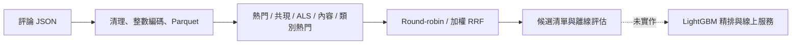

# Amazon Reviews：5.71 億筆評論的單機離線召回系統

以 Amazon Reviews 2023 的評論互動為訊號，完成單機資料管線、多路候選召回與時間切分評估。
**目前完成候選生成；LightGBM 精排、線上 API、延遲 SLO 與 A/B 測試尚未完成。**
評論時間不是購買時間，資料也不是完整交易紀錄。

[圖文報告](reports/web_report.html) · [三位使用者展示](reports/demo/demo.html) ·
[評估協定與重跑方式](docs/evaluation_protocol.md) · [歷史結果紀錄](reports/legacy_results.json)

## 問題與完成範圍

給定使用者在切分點之前的評論互動，產生候選清單，評估是否包含他在未來時間窗內
首次互動的商品。答案是商品集合，不是嚴格的 next-item，也不代表預測所有購買。
低評分目前仍被當作互動，未建模滿意度；這是隱式訊號的限制。



- 已實作：下載與續傳、資料清理與品質報告、使用者抽樣、五路召回、時間切分、評估。
- 本次修正：ALS 標準 fold-in、使用者／商品雙向分塊 Top-K、嚴格人數抽樣上限、
  加權 RRF、JSON 實驗紀錄、冷商品診斷、paired bootstrap、三位使用者合成展示、
  內容式通道，以及把內容式通道的屬性表改成必須由 `--items` 明確指定。
- 已完成：valid 權重掃描與**設定凍結後的一次性 test 執行**（見下）。
- 尚未實作：精排、模型持久化與部署、低延遲索引、線上監控與 A/B 實驗。

## 歷史全量工程結果

以下沿用舊版專案的量測紀錄；本次修正環境沒有原始 D 槽資料，**沒有重新驗證全量數字**。
原始執行 log、完整命令與資料內容指紋未隨 repo 保存，勿當成新版本 benchmark。

| 項目 | 歷史紀錄 |
|---|---:|
| 原始列數 | 571,544,897 |
| 去重後互動 | 564,540,881 |
| 使用者 / 商品 | 54,514,264 / 48,185,153 |
| 類別檔 | 34（33 個正式類別 + Unknown） |
| 時間範圍 | 1996-06-17 ～ 2023-09-14 |
| 壓縮原始檔 → Parquet | 71.2 GB → 6.0 GB |
| 轉檔耗時 | 30.8 分鐘 |
| 原執行環境 | i5-14500、64 GB RAM、無 GPU |

這些數字描述資料處理規模，不代表每個模型都訓練了全部使用者與商品。
舊 ALS 實驗經門檻過濾後，約使用 1,250 萬位使用者、1,152 萬件商品。

### 可以深入討論的工程取捨

1. **先量測，再調整。** 舊量測在約 2,950 萬列上比較去重：視窗函數 3.6 秒、
   GROUP BY 9.3 秒、先編碼再 GROUP BY 22.2 秒。原先以為換成 GROUP BY 就會更快，
   結果不支持這個假說。
2. **分階段落地。** 原本記憶體暫存表佔約 45.5 GB，接近 48 GB 預算；
   改以 staging Parquet 串接解析、映射、去重，歷史紀錄的 spill 從 73 GB 降到 37 GB。
   不能用「壓縮後只有 6 GB」推論所有中間操作都只需要 6 GB。
3. **單機的適用範圍。** 目前批次任務可在單機完成，DuckDB 降低部署成本；
   若更新頻率、多人並行、容錯或資料增量超出單機能力，需重新評估分散式方案。
4. **限制共現的平方成本。** 使用時間窗、每人最近 N 筆與共現次數門檻；
   用幾何平均熱度正規化，減少熱門商品主導鄰居表。
5. **整數 ID 與 parent_asin。** 減少字串成本，以父商品彙整變體。映射表放在相鄰目錄
   可降低錯配機率，但不是不可錯配的保證；生產環境仍需資料版本 manifest。

GROUP BY 的狀態隨 distinct key 數增加，排序與雜湊都可能 spill；實際記憶體還包括
join、緩衝與執行器開銷。不能以「只有 GROUP BY 跑得完」作普遍結論。

## 最終 test 結果（設定凍結後執行一次）

權重在 valid 選定為 1／1／0.25 後凍結，test 只跑這一次，沒有回頭調整。
test：歷史 `ts < 2023-06-01`，答案 `[2023-06-01, 2023-09-10)`，20,000 位使用者。
紀錄在 `reports/runs/test-final.json`。

| 加權 RRF 1／1／0.25 | valid | test | 變化 |
|---|---:|---:|---:|
| Recall@10 | 0.00401 | 0.00388 | −3.3% |
| Recall@100 | 0.01252 | 0.01096 | −12.4% |
| Recall@500 | 0.03023 | 0.02778 | **−8.1%** |
| NDCG@500 | 0.00703 | 0.00629 | −10.5% |

絕對數字下降，這是預期的：0.25 是在 valid 上挑出來的。但熱門基線也一起下降，
**相對熱門的提升反而略為擴大**：

| | 熱門 Recall@500 | 融合 Recall@500 | 提升 |
|---|---:|---:|---:|
| valid | 0.02532 | 0.03023 | +19.4% |
| test | 0.02301 | 0.02778 | **+20.8%** |

test 的 paired bootstrap 全部不跨 0：Recall@10 +0.00096 [+0.00041, +0.00151]、
Recall@100 +0.00205 [+0.00141, +0.00270]、Recall@500 +0.00478 [+0.00363, +0.00596]。

### test 不只是「比較晚的 valid」，它是更難的族群

合格條件完全相同，但人群結構差很多：

| | valid | test |
|---|---:|---:|
| 平均歷史長度 | 21.5 | **4.8** |
| 平均答案數 | 2.22 | 1.85 |
| 答案落在使用者買過的類別內 | 60.3% | **35.0%** |
| 答案存在於共現圖中 | 21.7% | 20.3% |

原因是 test 的 cutoff 是 2023-06-01，因此 2023 上半年才開始評論的使用者也符合資格——
這批人在 valid 的 cutoff（2023-03-01）之前沒有任何歷史，根本不在 valid 的母體裡。
薄歷史、高跨類別的新使用者把整體稀釋了。

提升在這種族群位移下仍然撐住，比兩段人群相同時更有說服力；
但這是**一次觀察**，不能因此宣稱模型對任何族群都穩健。

各通道承受位移的能力差很多：

| 單路通道 Recall@500 | valid | test | 變化 |
|---|---:|---:|---:|
| 熱門 | 0.02532 | 0.02301 | −9.1% |
| 共現 | 0.00634 | 0.00247 | **−61.1%** |
| 內容 | 0.01033 | 0.01219 | **+18.0%** |

共現幾乎崩掉：歷史從 21.5 筆掉到 4.8 筆，可以拿來查鄰居的起點就少了一大半，
再加上共現圖本來就只覆蓋 20.3% 的答案。內容式反而變好，因為薄歷史的使用者
更依賴商品屬性——但這一路有已知的冷啟動偏誤（見下節），不能單看這個數字下結論。

**這一節之後不再調整任何參數。** 若要再改設定，必須重新切一段未使用過的時間窗。

## 修正後的 valid 成績

`--segment valid --max-users 20000 --seed 42`，候選 K=500，樣本指紋 `4176b658…`。
四次執行共用同一批 20,000 位使用者，可直接相減；原始紀錄在 `reports/runs/`。

| 單路通道 | Recall@10 | Recall@500 | NDCG@500 | coverage |
|---|---:|---:|---:|---:|
| 熱門 | 0.0025 | 0.0253 | 0.0054 | 0.00001 |
| 共現 | 0.0023 | 0.0063 | 0.0026 | 0.0012 |
| ALS（標準 fold-in） | 0.0011 | 0.0125 | 0.0028 | 0.0003 |
| 內容 | 0.0008 | 0.0103 | 0.0022 | 0.0528 |
| 類別熱門 | 0.0019 | 0.0200 | 0.0044 | 0.0003 |

**沒有任何一路單獨贏過熱門。** 類別熱門是第二強的單路，但仍低於全域熱門——
把熱度限制在使用者買過的類別裡，並沒有換到更好的候選。

| 加權 RRF（熱門／共現／第三路） | Recall@10 | Recall@500 | NDCG@500 | 候選聯集上限 |
|---|---:|---:|---:|---:|
| 熱門＋共現（基線） | 0.00388 | 0.02938 | 0.00682 | 0.0299 |
| ＋ALS，1／1／1 | 0.00254 | 0.02655 | 0.00600 | 0.0362 |
| ＋內容，1／1／1 | 0.00317 | 0.02750 | 0.00639 | 0.0383 |
| ＋內容，1／1／0.5 | 0.00406 | 0.02928 | 0.00692 | 0.0383 |
| ＋內容，1／1／0.35 | 0.00400 | 0.02994 | 0.00700 | 0.0383 |
| **＋內容，1／1／0.25** | 0.00401 | **0.03023** | **0.00703** | 0.0383 |
| ＋內容，1／1／0.15 | 0.00401 | 0.02994 | 0.00694 | 0.0383 |
| ＋類別熱門，1／1／0.25 | 0.00385 | 0.02995 | 0.00686 | 0.0394 |
| ＋類別熱門，1／1／0.5 | 0.00345 | 0.02979 | 0.00673 | 0.0394 |
| ＋類別熱門，1／1／1 | 0.00284 | 0.02992 | 0.00646 | 0.0394 |

**等權融合會被弱通道拖累。** 加入 ALS 或內容都讓候選聯集上限上升，實際交付的
500 長度清單卻同時下降——等權 RRF 讓 Recall@500 只有熱門一半的通道，跟熱門搶
同樣的前段名額。把內容降權到 0.25 後，Recall@500 比兩路基線高 2.9%、
Recall@10 高 3.3%，同時保住升高的上限。這是目前最好的設定。

對熱門的 paired bootstrap（同一批使用者、1,000 次重抽樣、95% percentile CI）：

| 設定 | ΔRecall@500 | 95% CI |
|---|---:|---|
| 熱門＋共現 | +0.00406 | [+0.00327, +0.00493] |
| ＋內容，權重 0.25 | +0.00491 | [+0.00383, +0.00602] |

內容權重掃過 0.15 / 0.25 / 0.35 / 0.5 / 1.0，Recall@500 在 0.25 見頂、往兩邊
單調下降。但 0.15、0.25、0.35 三點只差約 1%（0.02994 / 0.03023 / 0.02994），
**沒有做權重之間的 paired bootstrap，不能宣稱 0.25 顯著優於 0.15 或 0.35**；
能說的是 0.25 附近明顯優於 0 與 1.0。

類別熱門則是掃了也沒用：任何權重下 Recall@10 都低於基線，Recall@500 最高
只到 0.02995，全面輸給內容式的 0.03023。它把候選聯集上限推到最高（0.0394），
卻交付最少——上限與實際交付是兩回事，這是本專案第三次量到同一件事。

限制：CI 只衡量抽樣不確定性，未校正這次的權重挑選，也不代表線上收益。
**test 尚未執行。** 候選聯集上限也不是等預算比較：三路聯集有 1,500 個候選，
兩路只有 1,000 個，上限的 +27.9% 有一部分來自多出來的名額。

Recall@500 約 3.0%，而 cutoff 前目錄的理論上限是 89.7%。召回缺口仍是這個系統
最大的問題；精排救不回召回沒撈到的商品。

### 召回缺口在哪裡

`channel_reachability` 以答案互動為單位量三件事（20,000 位使用者、44,376 筆答案）：

| 診斷 | 數值 |
|---|---:|
| 答案落在使用者買過的類別內 | 60.3% |
| 跨類別（使用者從未買過該類別） | 39.7% |
| 答案商品存在於共現圖中 | **21.7%** |

最後一列解釋了為什麼調融合權重救不了共現：**共現圖根本碰不到 78.3% 的答案**，
不論權重怎麼給都撈不到。該修的是圖的覆蓋率（放寬 `min_cooccurrence`、
拉長 `window_days`、提高 `max_items_per_user`），不是融合層。

60.3% 同類別代表類別訊號本身有內容，但全域熱門已經隱含吃掉了大部分——
暢銷商品在自己的類別裡通常也是暢銷商品。這與類別熱門通道量到的結果一致。

### 內容式通道的已知偏誤

冷啟動候選來自 `items.parquet`，而它是 metadata 與 `item_map` 的內連接，
`item_map` 又建自**全時間範圍**的互動。因此「cutoff 前零互動」的冷商品，
等於「未來某個時點一定會有互動」的商品：cutoff 後才首次出現的商品有 902,209 件，
內容池的冷商品有 770,089 件，佔 85.4%。真實部署在 cutoff 當下無從得知哪些商品
將來會被買，冷池會大得多。**這一路觸及冷商品的能力因此被系統性高估**，
`build_items.py` 迴避了 `average_rating` 與 `rating_number` 的洩漏，
但候選集合本身的構成方式仍條件在未來上。修正需要保留沒有任何互動的商品，
這會改變 `item_map` 的語意，尚未實作。

## 歷史召回成績：不可當成修正後結果

舊報告：valid 區間 `[2023-03-01, 2023-06-01)`，21,317 位使用者，候選 K=500。
訓練與歷史只取 `ts < 2023-03-01`。下表保留原數值供追溯。

| 通道 | Recall@10 | Recall@500 | NDCG@10 |
|---|---:|---:|---:|
| 熱門 | 0.0023 | 0.0252 | 0.0015 |
| 共現 | 0.0027 | 0.0062 | 0.0020 |
| 舊 ALS（商品向量平均） | 0.0012 | 0.0104 | 0.0011 |
| 熱門＋共現，round-robin | 0.0037 | 0.0292 | 0.0023 |
| 三路 round-robin | 0.0030 | 0.0243 | 0.0021 |

依四捨五入數值，兩路 Recall@500 相對熱門提升約 **15.9%**，絕對增加 **0.4 個百分點**。
此為驗證集觀察，沒有舊版逐使用者結果可計算 CI，也尚未證實最終測試或線上收益。
候選 Recall@500 約 2.92%，代表精排可用的答案覆蓋仍有限，應優先理解召回缺口。

**來源限制：** 21,317 人的原始命令與抽樣設定未保存，無法確定與品質報告中
test 合格使用者 1,110,743 人的差異來源；兩者也不是同一時間段。
舊 `--max-users` 實際是 hash 比例門檻，本次改成合格使用者的嚴格 top-N 上限，
所以新舊樣本不能直接當成同一批比較。

共現放寬後單路 Recall@500 提升、合併 Recall@10 卻下降；加入舊 ALS 也下降。
這支持優先驗證融合策略，但**不能排除向量估計、通道品質、參數或樣本差異**。
RRF 已實作；預設等權不是調參結果，不宣稱一定優於 round-robin。

## ALS 修正與效能邊界

- 使用 `implicit.recalculate_user`，依訓練相同的 alpha / regularization 解 ALS 正規方程。
  舊版本使用歷史商品因子的平均；舊 ALS 成績應視為該近似方法的結果。
- 使用者批次與商品區塊分開控制。預設 64 位使用者 × 65,536 件商品分數塊，
  逐塊保留精確 Top-K；同分以全域商品 ID 排序。
- 舊版本以 `8_000_000 // n_items` 決定批次，1,152 萬件商品時仍是 batch=1。
  **大批次的效果已量到，而且瓶頸不是先前以為的 Top-K。** profile 顯示
  `_top_k` 佔 recommend 時間約八成，但那是誤導：真正的成本是記憶體頻寬。
  1.47 GB 的商品因子矩陣在 `user_batch=64` 下，20,000 位使用者要重掃 313 趟。
  用 0.72 GB 的因子矩陣（大到放不進快取）量測，512 位使用者、k=500：

  | `user_batch_size` | 掃描趟數 | 分數暫存 | 耗時 | 相對 64 |
  |---:|---:|---:|---:|---:|
  | 64 | 8 | 16 MB | 33.02s | 1.00x |
  | 256 | 2 | 64 MB | 26.11s | 1.26x |
  | 1024 | 1 | 256 MB | 22.38s | **1.48x** |
  | 2048 | 1 | 512 MB | 55.44s | 0.60x |

  2048 有明顯懸崖（分數暫存開始與因子矩陣搶記憶體），所以這是要調的參數，
  不是拉滿就好。真實的 1.47 GB / 313 趟效果應該更大，但**沒有量到，不宣稱**。
  預設仍是 64；要改需要同時放大 `max_score_mb`，否則會被夾住。
- **失敗的嘗試：向量化 Top-K。** 依 profile 把逐列 `_top_k` 改成整批
  `argpartition`，用 300 組含大量同分與 `-inf` 的隨機案例證明與原版逐位元
  等價，真實模型上輸出也完全相同——但慢 1.6 倍。原因是逐列版本只對
  `isfinite` 的子集做 partition，整批版本為了一次處理要多做約六趟全矩陣
  掃描，還要為每個區塊配置 33 MB 的 int64 複合鍵。只向量化「排除已互動
  商品」的版本在 176 個區塊、長歷史下也是 0.79x。兩版都已還原。
- 新版可限制分數暫存，**仍需掃描全部模型商品因子**，計算複雜度未改成次線性。
  低延遲線上服務仍需預計算或 ANN，且應評估近似搜尋的 recall 損失。
- 全量耗時已量到，而且**修正後更慢**：新版 fit 1,133 秒、recommend 10,597 秒
  （20,000 位使用者，1,250 萬使用者 × 1,152 萬商品，factors=32）。
  舊版近似法是 3,185.7 秒／21,317 位使用者，換算每位使用者 0.149 秒，
  新版 0.530 秒——**每位使用者慢約 3.6 倍**。分塊精確 Top-K 是逐使用者、
  逐區塊呼叫的，這是正確性換來的成本，尚未優化。
  品質方面 Recall@500 從 0.0104 升到 0.0125，但兩者樣本不同，不是乾淨的比較。

## 快速開始

需要 Python 3.12 與 uv。版本鎖定於 `uv.lock`。

```bash
uv sync --frozen --extra dev
uv run pytest -m "not network" -ra
uv run python scripts/07_demo.py
```

開啟 `reports/demo/demo.html`。所有商品與互動都明確標為合成，不需下載 71 GB。
若目錄已存在，改用 `--out reports/demo_new`；腳本拒絕覆寫既有結果。
Windows 建議 `PYTHONUTF8=1`，資料目錄可用 `AMAZON_DATA_ROOT` 覆寫。

評估這份合成展示（只驗證流程，不能當模型成績）：

```bash
uv run python scripts/06_recall_eval.py --src reports/demo/interactions --k 10 --eval-ks 10 --temp-dir reports/tmp --output reports/runs/demo-eval.json
```

已有原始資料的機器，固定 valid 使用者抽樣與設定重跑：

```bash
uv run python scripts/06_recall_eval.py --segment valid --max-users 20000 --seed 42 --channels popularity covisitation --weights 1 1 --output reports/runs/valid-two-channel.json
uv run python scripts/06_recall_eval.py --segment valid --max-users 20000 --seed 42 --channels popularity covisitation als --weights 1 1 1 --output reports/runs/valid-three-channel.json
uv run python scripts/06_recall_eval.py --segment valid --max-users 20000 --seed 42 --channels popularity covisitation content --weights 1 1 0.25 --items D:/amazon-reviews-2023/parquet/items/items.parquet --output reports/runs/valid-content-w025.json
uv run python scripts/06_recall_eval.py --segment valid --max-users 20000 --seed 42 --channels popularity covisitation category_popularity --weights 1 1 0.25 --output reports/runs/valid-catpop-w025.json
```

預設通道是 `popularity covisitation als`。內容式與類別熱門都不在預設清單：
前者需要 `--items` 指定的屬性表，後者需要 `--src` 有 `category_idx` 欄位
（合成展示資料沒有）。內容式必須同時給 `--channels content` 與 `--items`。
`--items` 指向的屬性表必須與 `--src` 出自同一份 `item_map`，否則 item_idx 會指向
完全不同的商品，而且不會報錯——腳本不再回退到全域設定路徑。

權重只可在 valid 調整；目前選定的 1／1／0.25 是與等權比較後的結果，不是完整掃描。
凍結設定後才跑 test；不能因 test 分數低再調權重。
JSON 保存程式指紋、套件版本、實際參數、樣本指紋、通道結果與失敗狀態。
更多命令與結果解讀見 [評估協定](docs/evaluation_protocol.md)。

## 測試與限制

測試包括：時間邊界、合格使用者抽樣、已見商品排除、手算 Recall / NDCG、
ALS 正規方程對照、分塊 Top-K 對照完整搜尋、RRF 權重與重複處理、冷商品診斷。

部分原有 ingest 測試需要本機原始資料，缺資料時會 skip；network 測試需另外連線。
以 [本次驗證紀錄](reports/verification.md) 的實際 passed / skipped / deselected 為準，
不使用固定的「75 passing」徽章代替測試結果。

評估只涵蓋有歷史且未來有新互動的使用者，不代表所有訪客。
cutoff 後才出現的商品仍留在答案分母，另列不可達比例。
coverage 改以 cutoff 前可見商品為分母，因此不與舊版全時間目錄 coverage 直接比較。
時間切分不能解決評論選擇偏差，也不保證線上收益。

## 專案結構

```text
src/amazon_recsys/
  ingest/       下載、清理、抽樣
  recall/       熱門、共現、ALS、內容、類別熱門、融合
  evaluation/   指標、時間切分、品質、實驗來源
  ranking/      尚未實作
scripts/        資料管線、06_recall_eval.py、07_demo.py
reports/        歷史結果、驗證紀錄、展示
```

資料來源：[Amazon Reviews 2023](https://amazon-reviews-2023.github.io/)，McAuley Lab。
授權：[MIT](LICENSE)。設計文件保留歷史規劃，不代表所有功能已落地。
