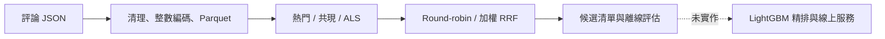

# Amazon Reviews：5.71 億筆評論的單機離線召回系統

以 Amazon Reviews 2023 的評論互動為訊號，完成單機資料管線、多路候選召回與時間切分評估。
**目前完成候選生成；LightGBM 精排、線上 API、延遲 SLO 與 A/B 測試尚未完成。**
評論時間不是購買時間，資料也不是完整交易紀錄。

[圖文報告](reports/web_report.html) · [三位使用者展示](reports/demo/demo.html) ·
[評估協定與重跑方式](docs/evaluation_protocol.md) · [歷史結果紀錄](reports/legacy_results.json)

## 問題與完成範圍

給定使用者在切分點之前的評論互動，產生候選清單，評估是否包含他在未來時間窗內
首次互動的商品。答案是商品集合，不是嚴格的 next-item，也不代表預測所有購買。
低評分目前仍被當作互動，未建模滿意度；這是隱式訊號的限制。



- 已實作：下載與續傳、資料清理與品質報告、使用者抽樣、三路召回、時間切分、評估。
- 本次修正：ALS 標準 fold-in、使用者／商品雙向分塊 Top-K、嚴格人數抽樣上限、
  加權 RRF、JSON 實驗紀錄、冷商品診斷、paired bootstrap、三位使用者合成展示。
- 尚待量測：修正後的全量品質與耗時、RRF 權重選擇、固定設定後的最終 test 結果。
- 尚未實作：精排、模型持久化與部署、低延遲索引、線上監控與 A/B 實驗。

## 歷史全量工程結果

以下沿用舊版專案的量測紀錄；本次修正環境沒有原始 D 槽資料，**沒有重新驗證全量數字**。
原始執行 log、完整命令與資料內容指紋未隨 repo 保存，勿當成新版本 benchmark。

| 項目 | 歷史紀錄 |
|---|---:|
| 原始列數 | 571,544,897 |
| 去重後互動 | 564,540,881 |
| 使用者 / 商品 | 54,514,264 / 48,185,153 |
| 類別檔 | 34（33 個正式類別 + Unknown） |
| 時間範圍 | 1996-06-17 ～ 2023-09-14 |
| 壓縮原始檔 → Parquet | 71.2 GB → 6.0 GB |
| 轉檔耗時 | 30.8 分鐘 |
| 原執行環境 | i5-14500、64 GB RAM、無 GPU |

這些數字描述資料處理規模，不代表每個模型都訓練了全部使用者與商品。
舊 ALS 實驗經門檻過濾後，約使用 1,250 萬位使用者、1,152 萬件商品。

### 可以深入討論的工程取捨

1. **先量測，再調整。** 舊量測在約 2,950 萬列上比較去重：視窗函數 3.6 秒、
   GROUP BY 9.3 秒、先編碼再 GROUP BY 22.2 秒。原先以為換成 GROUP BY 就會更快，
   結果不支持這個假說。
2. **分階段落地。** 原本記憶體暫存表佔約 45.5 GB，接近 48 GB 預算；
   改以 staging Parquet 串接解析、映射、去重，歷史紀錄的 spill 從 73 GB 降到 37 GB。
   不能用「壓縮後只有 6 GB」推論所有中間操作都只需要 6 GB。
3. **單機的適用範圍。** 目前批次任務可在單機完成，DuckDB 降低部署成本；
   若更新頻率、多人並行、容錯或資料增量超出單機能力，需重新評估分散式方案。
4. **限制共現的平方成本。** 使用時間窗、每人最近 N 筆與共現次數門檻；
   用幾何平均熱度正規化，減少熱門商品主導鄰居表。
5. **整數 ID 與 parent_asin。** 減少字串成本，以父商品彙整變體。映射表放在相鄰目錄
   可降低錯配機率，但不是不可錯配的保證；生產環境仍需資料版本 manifest。

GROUP BY 的狀態隨 distinct key 數增加，排序與雜湊都可能 spill；實際記憶體還包括
join、緩衝與執行器開銷。不能以「只有 GROUP BY 跑得完」作普遍結論。

## 歷史召回成績：不可當成修正後結果

舊報告：valid 區間 `[2023-03-01, 2023-06-01)`，21,317 位使用者，候選 K=500。
訓練與歷史只取 `ts < 2023-03-01`。下表保留原數值供追溯。

| 通道 | Recall@10 | Recall@500 | NDCG@10 |
|---|---:|---:|---:|
| 熱門 | 0.0023 | 0.0252 | 0.0015 |
| 共現 | 0.0027 | 0.0062 | 0.0020 |
| 舊 ALS（商品向量平均） | 0.0012 | 0.0104 | 0.0011 |
| 熱門＋共現，round-robin | 0.0037 | 0.0292 | 0.0023 |
| 三路 round-robin | 0.0030 | 0.0243 | 0.0021 |

依四捨五入數值，兩路 Recall@500 相對熱門提升約 **15.9%**，絕對增加 **0.4 個百分點**。
此為驗證集觀察，沒有舊版逐使用者結果可計算 CI，也尚未證實最終測試或線上收益。
候選 Recall@500 約 2.92%，代表精排可用的答案覆蓋仍有限，應優先理解召回缺口。

**來源限制：** 21,317 人的原始命令與抽樣設定未保存，無法確定與品質報告中
test 合格使用者 1,110,743 人的差異來源；兩者也不是同一時間段。
舊 `--max-users` 實際是 hash 比例門檻，本次改成合格使用者的嚴格 top-N 上限，
所以新舊樣本不能直接當成同一批比較。

共現放寬後單路 Recall@500 提升、合併 Recall@10 卻下降；加入舊 ALS 也下降。
這支持優先驗證融合策略，但**不能排除向量估計、通道品質、參數或樣本差異**。
RRF 已實作；預設等權不是調參結果，不宣稱一定優於 round-robin。

## ALS 修正與效能邊界

- 使用 `implicit.recalculate_user`，依訓練相同的 alpha / regularization 解 ALS 正規方程。
  舊版本使用歷史商品因子的平均；舊 ALS 成績應視為該近似方法的結果。
- 使用者批次與商品區塊分開控制。預設 64 位使用者 × 65,536 件商品分數塊，
  逐塊保留精確 Top-K；同分以全域商品 ID 排序。
- 舊版本以 `8_000_000 // n_items` 決定批次，1,152 萬件商品時仍是 batch=1，
  不能宣稱已量測到大型批次加速。
- 新版可限制分數暫存，**仍需掃描全部模型商品因子**，計算複雜度未改成次線性。
  低延遲線上服務仍需預計算或 ANN，且應評估近似搜尋的 recall 損失。
- 尚未重跑新版本全量耗時，不提供加速倍數。

## 快速開始

需要 Python 3.12 與 uv。版本鎖定於 `uv.lock`。

```bash
uv sync --frozen --extra dev
uv run pytest -m "not network" -ra
uv run python scripts/07_demo.py
```

開啟 `reports/demo/demo.html`。所有商品與互動都明確標為合成，不需下載 71 GB。
若目錄已存在，改用 `--out reports/demo_new`；腳本拒絕覆寫既有結果。
Windows 建議 `PYTHONUTF8=1`，資料目錄可用 `AMAZON_DATA_ROOT` 覆寫。

評估這份合成展示（只驗證流程，不能當模型成績）：

```bash
uv run python scripts/06_recall_eval.py --src reports/demo/interactions --k 10 --eval-ks 10 --temp-dir reports/tmp --output reports/runs/demo-eval.json
```

已有原始資料的機器，固定 valid 使用者抽樣與設定重跑：

```bash
uv run python scripts/06_recall_eval.py --segment valid --max-users 20000 --seed 42 --channels popularity covisitation --weights 1 1 --output reports/runs/valid-two-channel.json
uv run python scripts/06_recall_eval.py --segment valid --max-users 20000 --seed 42 --channels popularity covisitation als --weights 1 1 1 --output reports/runs/valid-three-channel.json
```

權重 1/1/1 是起點，請只在 valid 調參。凍結設定後才跑 test；不能因 test 分數低再調權重。
JSON 保存程式指紋、套件版本、實際參數、樣本指紋、通道結果與失敗狀態。
更多命令與結果解讀見 [評估協定](docs/evaluation_protocol.md)。

## 測試與限制

測試包括：時間邊界、合格使用者抽樣、已見商品排除、手算 Recall / NDCG、
ALS 正規方程對照、分塊 Top-K 對照完整搜尋、RRF 權重與重複處理、冷商品診斷。

部分原有 ingest 測試需要本機原始資料，缺資料時會 skip；network 測試需另外連線。
以 [本次驗證紀錄](reports/verification.md) 的實際 passed / skipped / deselected 為準，
不使用固定的「75 passing」徽章代替測試結果。

評估只涵蓋有歷史且未來有新互動的使用者，不代表所有訪客。
cutoff 後才出現的商品仍留在答案分母，另列不可達比例。
coverage 改以 cutoff 前可見商品為分母，因此不與舊版全時間目錄 coverage 直接比較。
時間切分不能解決評論選擇偏差，也不保證線上收益。

## 專案結構

```text
src/amazon_recsys/
  ingest/       下載、清理、抽樣
  recall/       熱門、共現、ALS、融合
  evaluation/   指標、時間切分、品質、實驗來源
  ranking/      尚未實作
scripts/        資料管線、06_recall_eval.py、07_demo.py
reports/        歷史結果、驗證紀錄、展示
```

資料來源：[Amazon Reviews 2023](https://amazon-reviews-2023.github.io/)，McAuley Lab。
授權：[MIT](LICENSE)。設計文件保留歷史規劃，不代表所有功能已落地。
